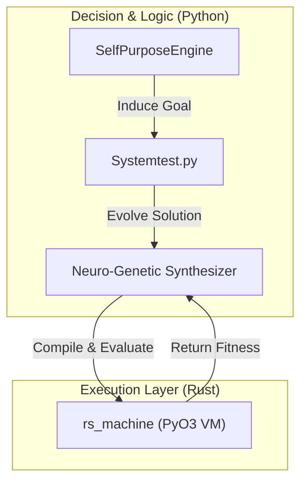

# Neuro-Genetic Structural Synthesis and Autonomous Discovery

## Abstract

This repository presents an experimental framework for **autonomous program synthesis** and **emergent mathematical concept discovery** via neuro-genetic evolution. The system operates without human-defined objectives, synthesizing executable programs and inferring novel computational goals through temporal inversion of observed input/output patterns.

## System Components

| Module | Language | Role |
|---|---|---|
| `neuro_genetic_synthesizer.py` | Python | Hybrid evolutionary AST generation |
| `self_purpose_engine.py` | Python | Autonomous goal induction via temporal inversion |
| `concept_transfer.py` | Python | Cross-domain concept generalization |
| `rs_machine/` | Rust (PyO3) | High-performance stack-based execution VM |
| `autonomous_rsi_loop.py` | Python | Recursive self-improvement (RSI) orchestration |

## Architecture



## Empirical Results

- **Emergent Complexity (2026-01-11):** The system autonomously evolved a 4.6 KB genetic program (`triangular_g1662`) approximating the triangular number sequence \(T(n) = n(n+1)/2\) using deeply nested control-flow primitives (`if_gt`, `div`, `mod`, `mul`), without hardcoded target logic.
- **Autonomous Goal Discovery:** Verified induction of arithmetic progressions from unlabeled expression outputs (`EMERGENT PURPOSE: linear_d2`).
- **Persistence:** 147+ evolutionary checkpoints persisted to disk autonomously.

## Installation

**Prerequisites:** Python 3.8+, Rust toolchain, `maturin`

```bash
# Build Rust acceleration layer
cd rs_machine && maturin develop --release && cd ..

# Run autonomous discovery loop
python Systemtest.py hrm-life
```

> The system gracefully degrades to a pure-Python interpreter if the Rust binary is unavailable.

## Research Context

This system constitutes a preliminary empirical investigation into **open-ended program synthesis** at the intersection of genetic programming, meta-learning, and recursive self-improvement (RSI). The `SelfPurposeEngine` implements a form of *intrinsic motivation* through inverse problem generation—enabling the system to define and pursue novel computational objectives without external reward signals.
